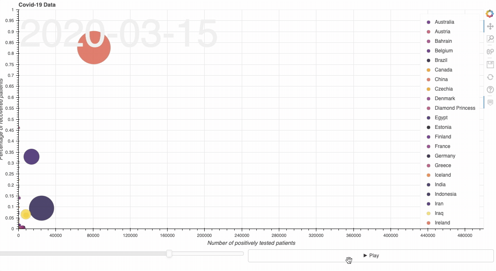

# COVID-19 development Gapminder visualisation



## Demo

We've deployed this demo at: https://covid-19-visualisation.herokuapp.com/main for convenience.

## Run the demo yourself locally

To use this demo, first clone this repo together with its submodule and `cd` into it:

```bash_script
git clone --recursive git@github.com:maxpumperla/covid-19-vis.git
cd covid-19-vis
```

then install the requirements in a virtual environment and start a bokeh server.

```bash_script
virtualenv venv && source venv/bin/activate
pip install -r requirements.txt
bokeh serve --show main.py
```

If you want to update the underlying data, either pull the `covid-19` submodule or regenerate
data accordingly to the instructions in the `covid-19` folder.

## Deploy your own demo to Heroku

We chose Heroku for ease of deployment and the fact that private projects are free. If you want to deploy this demo, but haven't worked with Heroku, check out [this introduction](https://devcenter.heroku.com/articles/getting-started-with-python). After you've made sure to have the `heroku` command line tool and are logged in, you can proceed as follows.

```bash_script
heroku create -a <your-app-name>
```

The only things you need to make sure is that the app name you choose isn't taken. Next, you have to adapt the `Procfile` to reflect the name of your app like so:

```yaml
web: bokeh serve --port=$PORT --address=0.0.0.0 --allow-websocket-origin=<your-app-name>.herokuapp.com --use-xheaders main.py
```

The last step is to push your app to the Heroku remote with

```bash_script
git push heroku master
```

That's it, your app should now be live at `<your-app-name>.herokuapp.com`.